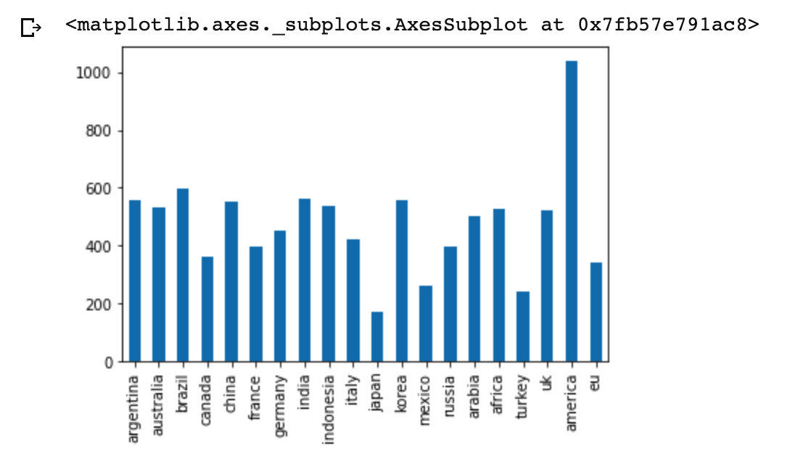
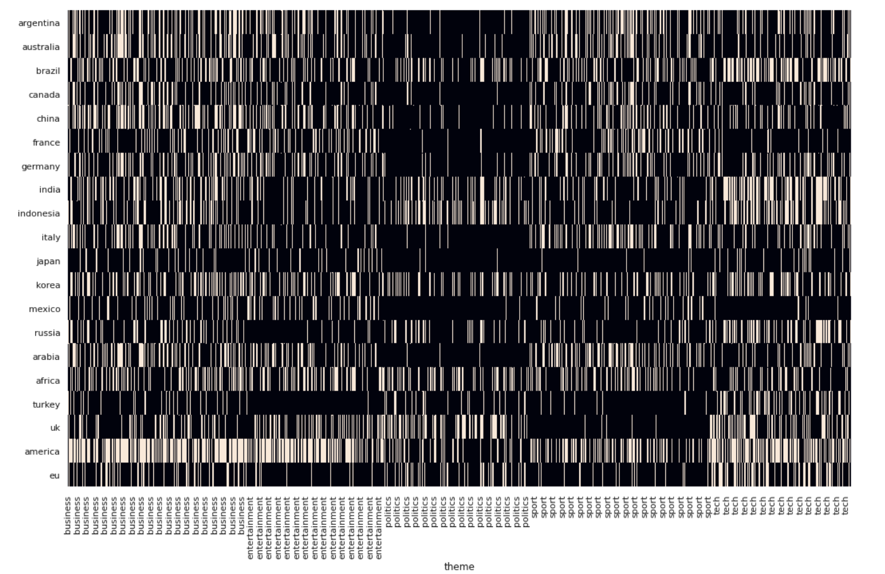

# tegger-challenge

###This is the workspace for Tegger's NLP Challenge

##Answers to Questions: 

##1) How many articles are about G20 countries? Please show the number of articles for each individual country and those that have an overlap in talking about several countries.

- only about ~230 articles were not sufficently associated with any of the g20 countries. 
- 

- a good way to see overlap in talking about different countries is to see a heatmap. 

Here you can see how America dominates business and entertainment themed articles and also how political articles usually address fewer countries per article! 

##2) What are the most common themes in each article section?

TF-IDF and Count Vectorizer show the following predominant themes - 

entertainment

 - achievement awards
 - upcoming projects
 - monetary values in terms of budgets
 - beauty
 - top actors and actresses
 - Celebrities

business

- smaller and greater values
- finance
- lawyers
- mergers
- improvement
- cars
- deficits
- goals and ilestones reached
- threats to companies and economies

politics

- margins
- credit
- ministers
- development
- government involvement
- news
- committees

sport

- skills
- manchester city (soccer)
- athletes
- fans
- germany
- favours

tech

- china
- clicks
- corporations
- installations
- operating systems
- bandwith
- money

##3) How long did you work on the technical assignment?

- About 20 hours now

##4) What tools did you use for the assignment?

- mainly python as seen in the repo and sklearn with seaborn. My biggest tool was Gensim for word embeddings which was what I used to find document relevance. 

##5) Please describe the process you used to complete the assignment.

- data loading and preprocessing --> naively tagging mentions of G20 countries --> word embeddings (50k) --> average over all words for doc --> compare doc embeddings to relevant g20 word embeddings --> cosine similarity scores --> fixing a cut off point --> making matrix of binary relavance --> visualization

##6) How would you test if survey responses were filled at random by certain individuals, as opposed to truthful selections?

- what stage of the process are we on? If still designing survey --> item response theory --> create tests like equally desirable items worded positively and negatively so that illegitimacy can be exposed
- after survey reponses have been collected --> one way is to use cronbach's alpha to test within-survey reliability of responses = did similar questions get answered in a similar way? We can do some hypothesis testing by comparing to a completely random response set and seeing how much more consistent the inidvidual's selections are. Another way is to use Rasch analyses to check measure of random responding. 

###Aditya Singhal - adis@nyu.edu 
